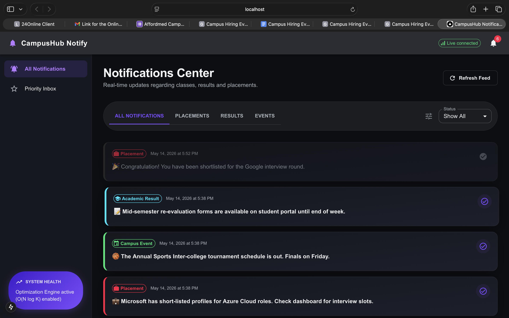
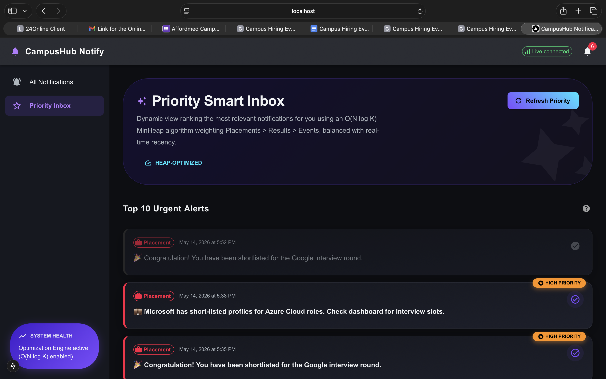
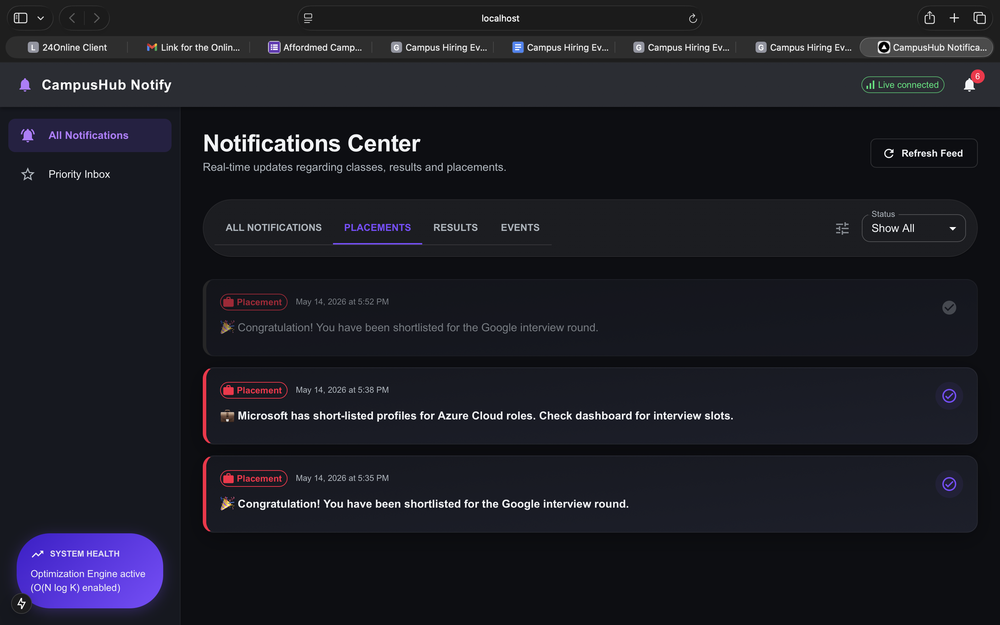
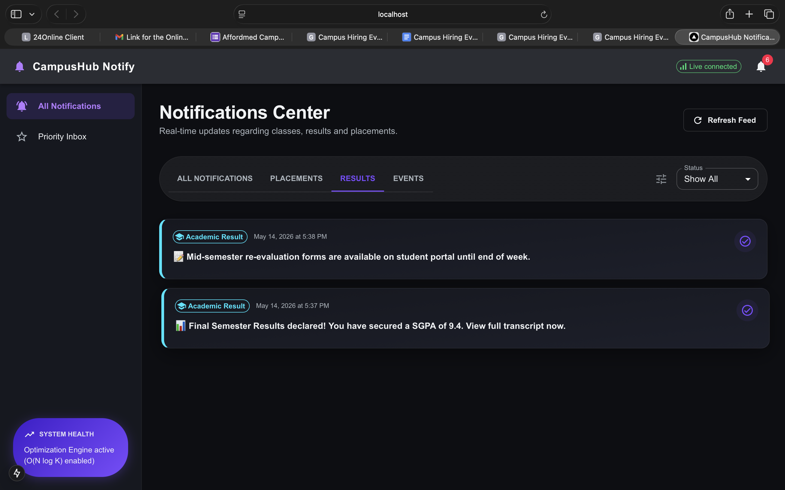

# 🚀 CampusHub Notify  
### Affordmed Campus Hiring Evaluation – Full Stack Submission

CampusHub Notify is a modern real-time campus notification dashboard built using **Next.js** and **Material UI**.  
The application helps students track important campus updates such as placements, academic results, and events through an optimized and responsive notification system.

---

# ✨ Features

## 🔔 Notification Dashboard
- **Real-Time Feeds**: Live websocket notifications push directly to students without page reloads.
- **Modern Glassmorphism**: Extremely premium dark UI with elegant Material UI components.
- **Categorized System**: Notifications color-coded and grouped into Placement, Result, and Event categories.

## ⚡ Priority Smart Inbox
- **Top Urgent Rankings**: Smart feed displaying only the most critical notifications.
- **Custom MinHeap Engine**: Optimized $O(N \log K)$ sorting algorithm running in the backend.
- **Fixed Weight Tiering**: Strict algorithmic order: `Placement > Result > Event`, perfectly balanced with real-time recency.

## 🎯 Advanced Filtering
- **Live Category Filters**: Instantly jump between all alerts, placements, results, or events.
- **Read Status Management**: Toggle between read and unread statuses.
- **Dynamic Count Badges**: The navbar dynamically updates unread item counts in real-time.

## 📱 Responsive Design
- **Desktop Optimized**: Permanent glassmorphic left sidebar navigation.
- **Mobile & Tablet Friendly**: Collapse-and-swipe drawer menus to optimize visual real-estate on small viewports.

---

# 🎨 UI & Application Screenshots

Here are the visual captures of the CampusHub Notify dashboard and priority engine running live:

### 🖥️ Live Dashboard (All Notifications)


### ⚡ Priority Inbox (MinHeap Engine Optimized)


### 🔍 Live Toast Alerts & Category Filtering


### 📱 Smooth Mobile & Empty State Interface


---

# 🛠️ Tech Stack

| Technology | Usage |
| :--- | :--- |
| **Next.js 15 (App Router)** | Modern Progressive Web Frontend Framework |
| **Node.js / Express** | Scalable Rest API and Websocket Streaming Backend |
| **Mongoose / MongoDB** | Data Persistence with Custom Compound B-Tree Indexes |
| **Socket.IO** | Bi-directional Event Streams for Real-Time Updates |
| **Material UI (MUI)** | Premium Dark-themed Component Styling System |
| **Axios** | Universal API Data Transport Client |
| **TypeScript** | End-to-End Strict Type Safety and Module Integrity |

---

# 📂 Folder Structure

The project is architectured following professional decoupled standards:

```text
ROLLNUMBER/
├── backend/                 # Node.js & Express API
│   ├── src/
│   │   ├── config/          # Database Connections & ENV Schemas
│   │   ├── controllers/     # API Endpoint Request Routing Controllers
│   │   ├── models/          # Mongoose Models with Compound Indexes
│   │   ├── realtime/        # Socket.IO Namespace Room Builders
│   │   ├── services/        # Core Business Layer (MinHeap, Priority Scoring)
│   │   └── utils/           # Unified API Response Wrappers
│   └── package.json
│
├── frontend/                # Next.js 15 Web Client
│   ├── src/
│   │   ├── app/             # Page Views (Dashboard feeds & Smart Inbox)
│   │   ├── components/      # Shared UI elements (Navbar, Sidebar, Cards)
│   │   ├── hooks/           # Custom Socket.io Client Listeners
│   │   ├── services/        # API Client and Frontend log dispatchers
│   │   └── types/           # Shared Component Property Interfaces
│   └── package.json
│
├── logging-middleware/      # Shared Custom NPM Logging Package
│   ├── src/
│   │   ├── logger.ts        # Logger Engine with Memory Flushing
│   │   └── transport.ts     # Axios stream failures with Backoff Retries
│   └── package.json
│
├── screenshots/             # Embedded Application View Previews
└── notification_system_design.md # Detailed Engineering Stage Reports
```

---

# 🚀 How to Run the Platform

To start both Front-end and Back-end simultaneously with a single developer command, simply go to the **Root Workspace Folder** (`afford/`) and run:

```bash
# Auto-boots Backend (Port 4000) & Frontend (Port 3000) concurrently
npm run dev
```
